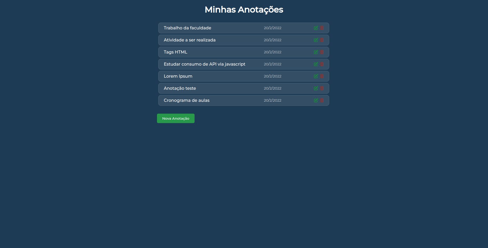
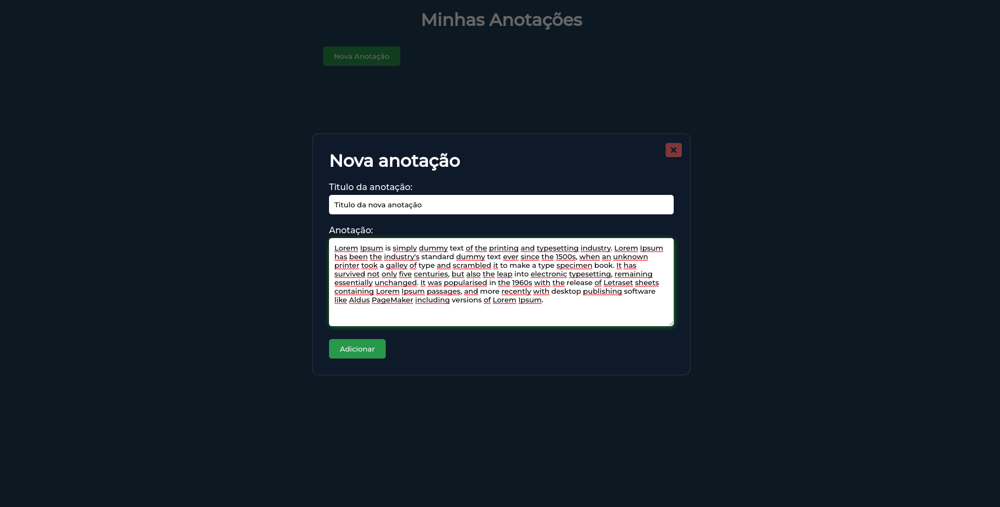
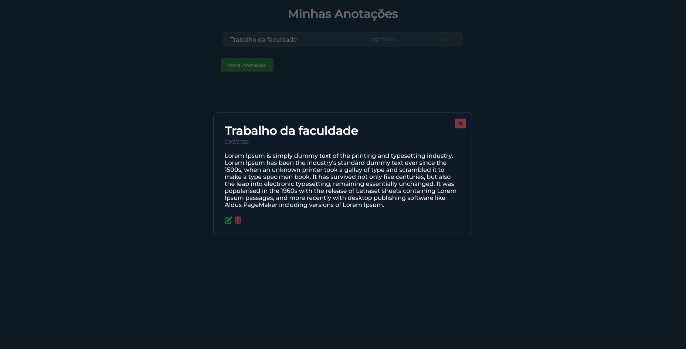

# Annotation project

## Brief summary

Project with functionality to add, remove or edit tasks.

## Preview

## Description

Project with functionality to add, remove or edit tasks.
The project does not have any connection to the database, it only serves as a programming practice exercise, creating just a basic CRUD (Create, Read, Update and Delete) with javascript.